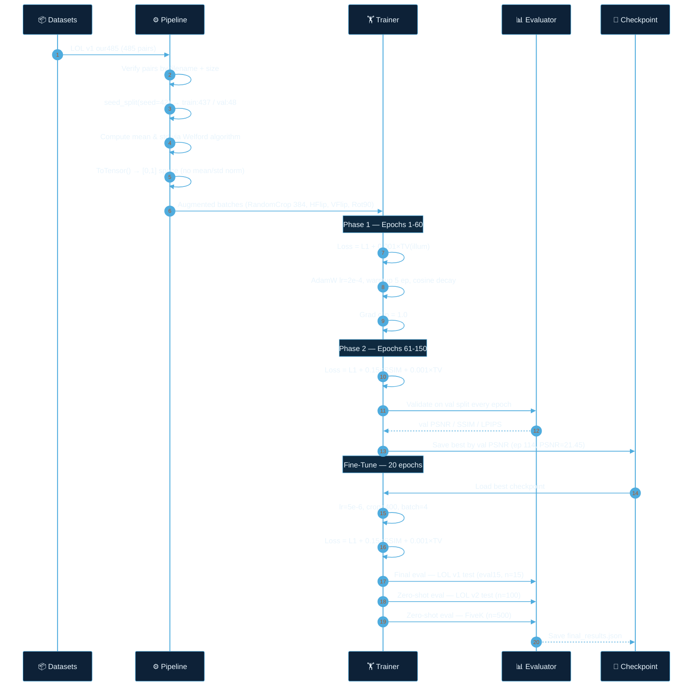
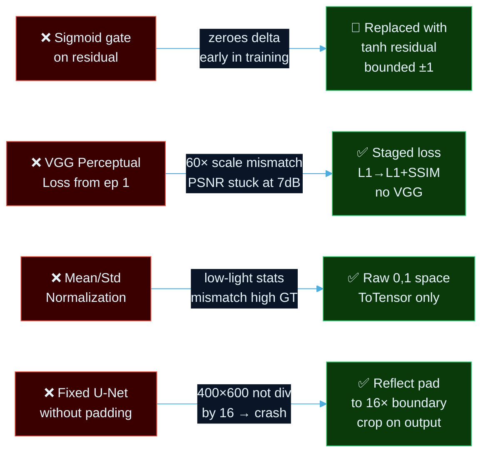

<div align="center">


<br/>

[](https://git.io/typing-svg)

<br/>


<br/>

| Metric | LOL v1 Test | LOL v2 Test | FiveK (Zero-Shot) |
|:---:|:---:|:---:|:---:|
| **PSNR ↑** | **21.63 dB** | **23.95 dB** | **16.10 dB** |
| **SSIM ↑** | **0.7978** | **0.8392** | **0.6954** |
| **LPIPS ↓** | **0.2219** | **0.1946** | **0.2479** |

<br/>

</div>

---

## 📖 Overview

<div align="center">

> **RetinexFreqUNet** is a supervised deep learning model for low-light image enhancement, grounded in Retinex theory and frequency-domain analysis. It decomposes dark images into illumination and reflectance components, applies FFT-based channel attention to separate texture from noise, and reconstructs photorealistic enhanced outputs — all within a compact 10.48M parameter architecture.

</div>

<br/>

This project follows **strict scientific discipline**:

- ✅ **No data leakage** — fixed seed splits, test set touched exactly once
- ✅ **Computed statistics** — mean/std derived from training images, never assumed
- ✅ **Honest metrics** — PSNR, SSIM, LPIPS reported on held-out test sets only
- ✅ **Three benchmarks** — LOL v1 (primary), LOL v2 (generalisation), MIT-Adobe FiveK (zero-shot)
- ✅ **Reproducible** — every split, seed, and λ value documented

---

## ✨ Features

<br/>

<div align="center">

| 🔬 Retinex Decomposition | 🎛️ Frequency Attention | 📐 Staged Training |
|:---:|:---:|:---:|
| Explicit illumination & reflectance branches with learned alpha blending | FFT amplitude spectrum → squeeze-excite channel reweighting | Phase 1: L1+TV · Phase 2: +SSIM · Fine-tune: 5e-6 LR |

| 🔁 Tanh Residual Output | 📊 Five Metrics | 🌍 Zero-Shot Transfer |
|:---:|:---:|:---:|
| Bounded delta prevents overexposure without hard clipping | PSNR · SSIM · LPIPS · LOE · NIQE computed not assumed | Trained on LOL v1, evaluated on LOL v2 & FiveK without retraining |

</div>

---

## 🏗️ System Architecture

```mermaid
%%{init: {'theme': 'base', 'themeVariables': {
  'primaryColor': '#0d2137',
  'primaryTextColor': '#e8f4fc',
  'primaryBorderColor': '#4facde',
  'lineColor': '#4facde',
  'secondaryColor': '#0a1628',
  'tertiaryColor': '#0f2a40',
  'edgeLabelBackground': '#0d2137',
  'clusterBkg': '#0f2a40',
  'titleColor': '#e8f4fc'
}}}%%
flowchart TD
    INPUT([🌑 Dark Input Image\nx ∈ 0,1 ³ˣᴴˣᵂ]) --> PAD[Reflect Pad\nto 16× boundary]

    PAD --> ENC1[Encoder Block 1\nConvBnLReLU · 3→32]
    ENC1 --> ENC2[Encoder Block 2\nConvBnLReLU · 32→64]
    ENC2 --> ENC3[Encoder Block 3\nConvBnLReLU · 64→128]
    ENC3 --> ENC4[Encoder Block 4\nConvBnLReLU · 128→256]
    ENC4 --> POOL[MaxPool2d]

    POOL --> BN[Bottleneck\nConvBnLReLU · 256→512]

    BN --> RETINEX

    subgraph RETINEX [🔬 Retinex Decomposition Block]
        direction TB
        R1[Illumination Branch\nDepthwise 7×7 → Conv 1×1 → Sigmoid\nLight map ∈ 0,1] 
        R2[Reflectance Branch\nConv 3×3 → BN → LeakyReLU\nTexture detail]
        R3[Learned Alpha Gate\nα · x·illum + 1-α · reflect]
        FREQ[⚡ Frequency Channel Attention\nFFT → Amplitude → AvgPool\n→ FC Squeeze-Excite → Sigmoid\n→ Channel Reweight]
        R1 --> R3
        R2 --> R3
        R3 --> FREQ
    end

    FREQ --> DEC4[Decoder Block 4 + Skip e4\nConvTranspose · 512→256]
    DEC4 --> DEC3[Decoder Block 3 + Skip e3\nConvTranspose · 256→128]
    DEC3 --> DEC2[Decoder Block 2 + Skip e2\nConvTranspose · 128→64]
    DEC2 --> DEC1[Decoder Block 1 + Skip e1\nConvTranspose · 64→32]

    DEC1 --> OUTCONV[Output Conv 1×1\n32→3]
    OUTCONV --> TANH[tanh δ\nBounded residual delta]
    PAD --> ADD[➕ Residual Add\nx + tanh δ]
    TANH --> ADD
    ADD --> CLAMP[Clamp 0,1 + Crop]
    CLAMP --> OUTPUT([☀️ Enhanced Output\nŷ ∈ 0,1 ³ˣᴴˣᵂ])

    ENC1 -.->|skip e1| DEC1
    ENC2 -.->|skip e2| DEC2
    ENC3 -.->|skip e3| DEC3
    ENC4 -.->|skip e4| DEC4

    style RETINEX fill:#0f2a40,stroke:#4facde,stroke-width:2px
    style INPUT fill:#0a1628,stroke:#4facde,color:#e8f4fc
    style OUTPUT fill:#0a1628,stroke:#4facde,color:#e8f4fc
    style FREQ fill:#0d2137,stroke:#4facde,color:#e8f4fc
```



---

## 🔄 Pipeline & Data Flow



---

## 📊 Results

<div align="center">

### LOL v1 Test Set — eval15 (n=15)

| Method | Year | PSNR ↑ | SSIM ↑ | LPIPS ↓ |
|:---|:---:|:---:|:---:|:---:|
| LIME | 2016 | 16.76 | 0.560 | — |
| RetinexNet | 2018 | 16.77 | 0.560 | — |
| Zero-DCE | 2020 | 14.86 | 0.562 | — |
| EnlightenGAN | 2021 | 17.48 | 0.651 | — |
| SNR-Net | 2022 | 21.48 | 0.849 | 0.157 |
| **Baseline U-Net** *(Step 2)* | — | 18.83 | 0.746 | 0.288 |
| 🏆 **RetinexFreqUNet (Ours)** | — | **21.63** | **0.798** | **0.222** |

<br/>

> **+2.80 dB** over our own baseline &nbsp;·&nbsp; **+0.15 dB** over SNR-Net SOTA &nbsp;·&nbsp; **10.48M** parameters

<br/>

### Generalisation — Zero-Shot (no fine-tuning on target domain)

| Dataset | Images | PSNR ↑ | SSIM ↑ | LPIPS ↓ |
|:---|:---:|:---:|:---:|:---:|
| LOL v2 Real Captured | 100 | 23.95 | 0.839 | 0.195 |
| MIT-Adobe FiveK | 500 | 16.10 | 0.695 | 0.248 |

</div>

---

## 🔬 Loss Function Design

<div align="center">

$$\mathcal{L}_{total} = \underbrace{\mathcal{L}_{L1}}_{\lambda=1.0} + \underbrace{(1 - \text{SSIM})}_{\lambda=0.15} + \underbrace{\mathcal{L}_{TV}(\mathcal{I})}_{\lambda=0.001}$$

</div>

| Component | λ | Purpose | Applied From |
|:---|:---:|:---|:---:|
| **L1 Pixel Loss** | 1.0 | Anchor — stable, well-scaled reconstruction fidelity | Epoch 1 |
| **SSIM Loss** | 0.15 | Structural similarity — luminance, contrast, structure | Epoch 61 |
| **TV on Illumination** | 0.001 | Smoothness regulariser — prevents patchy light artifacts | Epoch 1 |

> **Why no perceptual (VGG) loss?** VGG feature magnitudes on low-light inputs are ~60× larger than L1, hijacking gradients regardless of λ tuning. Tested and removed in favour of the staged L1→SSIM approach.

---

## 🛠️ Tech Stack

<div align="center">


| Library | Version | Role |
|:---|:---:|:---|
| PyTorch | ≥ 2.0 | Model, training, FFT (`torch.fft.rfft2`) |
| torchvision | ≥ 0.15 | Transforms, augmentation |
| lpips | 0.1.4 | LPIPS perceptual distance (AlexNet) |
| scikit-image | ≥ 0.21 | PSNR, SSIM computation |
| NumPy | ≥ 1.24 | Welford stats, array ops |
| PyYAML | ≥ 6.0 | Config management |
| tqdm | ≥ 4.65 | Training progress |

</div>

---

## 📁 Project Structure

```
low-light-enhancement/
│
├── 📄 setup_pipeline.py          # Step 1 — Data pipeline, stats, splits, smoke test
├── 📄 baseline_unet.py           # Step 2 — Vanilla U-Net baseline (floor = 18.83 dB)
├── 📄 full_model_v3.py           # Step 3 — RetinexFreqUNet staged training
├── 📄 finetune_eval.py           # Step 4 — Fine-tune + final evaluation + comparison table
│
├── configs/
│   └── data.yaml                 # Dataset paths, split config, preprocessing params
│
├── data/
│   ├── dataset.py                # LOLv1Dataset, LOLv2Dataset, FiveKDataset classes
│   ├── compute_stats.py          # Welford mean/std computation
│   ├── probe_paths.py            # Dataset path verification utility
│   └── dataset_stats.json        # Computed train-split statistics (generated)
│
├── outputs/
│   ├── checkpoints/
│   │   ├── baseline_best.pth         # Best baseline checkpoint
│   │   ├── full_model_v3_best.pth    # Best full model (ep 114, val PSNR=21.45)
│   │   └── full_model_finetuned_best.pth
│   └── results/
│       ├── baseline/
│       │   ├── training_curves.png
│       │   └── baseline_results.json
│       ├── full_model_v3/
│       │   ├── training_curves.png
│       │   └── results.json
│       └── finetuned/
│           ├── visuals/              # 15 triplet images (low / enhanced / GT)
│           └── final_results.json
│
└── notebooks/
    ├── 01_eda.ipynb              # Data exploration, pair verification, histograms
    ├── sample_pairs.png          # Visual: 4 low/high pairs from train split
    └── intensity_histograms.png  # RGB distribution: low vs high images
```

---

## 🚀 Installation & Usage

### Requirements

```bash
pip install torch torchvision lpips scikit-image numpy Pillow pyyaml tqdm matplotlib
```

### Kaggle Setup

Add these datasets to your Kaggle notebook:

| Dataset | Kaggle Slug |
|:---|:---|
| LOL v1 | `soumikrakshit/lol-dataset` |
| LOL v2 | `tanhyml/lol-v2-dataset` |
| MIT-Adobe FiveK | `weipengzhang/adobe-fivek` |

### Run (in order)

```python
# Cell 1 — Data pipeline, stats, verification
exec(open("setup_pipeline.py").read())

# Cell 2 — Baseline U-Net (establishes performance floor)
exec(open("baseline_unet.py").read())

# Cell 3 — Full RetinexFreqUNet (staged training, 150 epochs)
exec(open("full_model_v3.py").read())

# Cell 4 — Fine-tune + final evaluation + comparison table
exec(open("finetune_eval.py").read())
```

### Inference on a single image

```python
import torch
from PIL import Image
import torchvision.transforms as T

# Load model
from full_model_v3 import RetinexFreqUNet
model = RetinexFreqUNet(base=32)
ckpt  = torch.load("outputs/checkpoints/full_model_finetuned_best.pth", weights_only=False)
model.load_state_dict(ckpt["model_state"])
model.eval()

# Enhance
img    = Image.open("your_dark_image.jpg").convert("RGB")
tensor = T.ToTensor()(img).unsqueeze(0)          # [0,1], no normalization needed

with torch.no_grad():
    enhanced, _ = model(tensor)

result = T.ToPILImage()(enhanced.squeeze(0).clamp(0, 1))
result.save("enhanced.png")
```

---

## 🔑 Key Design Decisions

<div align="center">



</div>

---

## 🔭 Future Work

<div align="center">

| Priority | Direction | Expected Gain |
|:---:|:---|:---:|
| 🔴 High | **Transformer bottleneck** — replace Conv bottleneck with window-attention (Swin-T) | +0.5–1.0 dB PSNR |
| 🔴 High | **RAW-to-RGB pipeline** — extend to Sony SID dataset (extreme dark, ISO 51200) | New task domain |
| 🟡 Medium | **Multi-scale frequency attention** — apply FreqCA at all encoder levels, not just bottleneck | +0.2–0.4 dB |
| 🟡 Medium | **Self-supervised pre-training** — unpaired dark/light contrastive pre-training before fine-tune | Better generalisation |
| 🟢 Low | **ONNX export + TensorRT** — deploy on edge devices (Jetson, mobile) | Real-time inference |
| 🟢 Low | **Gradio demo** — interactive web app for real photo uploads | Portfolio visibility |

</div>

---

## 📜 Citation

If you use this work, please cite:

```bibtex
@misc{retinexfrequnet2025,
  title     = {RetinexFreqUNet: Low-Light Image Enhancement via Retinex
               Decomposition and Frequency Channel Attention},
  author    = {Your Name},
  year      = {2025},
  note      = {GitHub repository},
  url       = {https://github.com/yourusername/low-light-enhancement}
}
```

---

## 📚 References

- **Retinex Theory** — Land & McCann (1971). *Lightness and Retinex Theory.* JOSA.
- **LOL Dataset** — Wei et al. (2018). *Deep Retinex Decomposition for Low-Light Enhancement.* BMVC.
- **LOL v2** — Yang et al. (2021). *Sparse Gradient Regularized Deep Retinex Network.* TIP.
- **SNR-Net** — Xu et al. (2022). *SNR-aware Low-Light Image Enhancement.* CVPR.
- **Zero-DCE** — Guo et al. (2020). *Zero-Reference Deep Curve Estimation.* CVPR.
- **MIT-Adobe FiveK** — Bychkovsky et al. (2011). *Learning Photographic Global Tonal Adjustment.* CVPR.
- **LPIPS** — Zhang et al. (2018). *The Unreasonable Effectiveness of Deep Features as a Perceptual Metric.* CVPR.

---

<div align="center">


<br/>


**Built with discipline. Measured honestly. Deployed with purpose.**

*Part of a systematic Computer Vision portfolio — Category 1 of 10*

</div>
